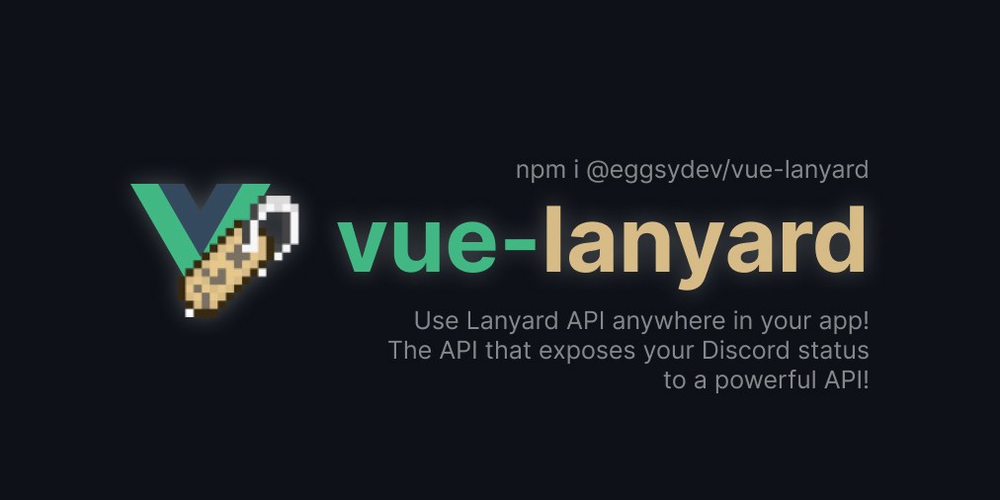

# 🚀 Vue Lanyard Plugin

> A Vue (2) plugin to track your Discord status using [Lanyard API](https://github.com/Phineas/lanyard/).

<p align="center">



</p>

Lanyard is a service that makes it super easy to export your live Discord presence to an API endpoint and to a WebSocket for you to use wherever you want. This plugin creates a connection between Lanyard and your Vue app **as a plugin** and lets you access the `$lanyard` anywhere in your app!

✨ **This plugin supports both REST and WebSocket methods.**

> ⚠️ **Version 2.0.0** - BREAKING CHANGES! This is a major update to the plugin. The plugin has been completely rewritten in TypeScript and refactored all functions, dropping support for multiple user fetching and socket subscribing, but adding better handler to handle incoming data (`onMessage`) and using `isomorphic-fetch` to work on server-side too.

### 🔧 Install

You'll need [Node.js](https://nodejs.org) and an existing Vue app to use this plugin (you can find an example vue-cli app in `example/`).

- Download the module via NPM, Yarn or your package manager.
  - For NPM: `npm install @eggsydev/vue-lanyard`
  - For Yarn: `yarn add @eggsydev/vue-lanyard`

### 🤓 Setup

After you download the plugin, you have to import it into your app with `Vue.use()`. This will let you access the `$lanyard` method anywhere in your app!

```js
import Vue from "vue";
import VueLanyard from "@eggsydev/vue-lanyard";

Vue.use(VueLanyard);

// Rest of your Vue app configuration
```

And then you will have the access to `$lanyard` method in your app.

```js
export default {
  // Call it on `mounted`
  async mounted() {
    const response = await this.$lanyard({
      userId: "162969778699501569",
    });

    // Do whatever you want with Lanyard response object
  },
};
```

Lanyard method allows you to choose between WebSocket and REST connection. In both cases, the `userId` option is required. You can also have multiple IDs in array format.

```js
/*
  This will actually return multiple Lanyard objects in a single array.

  Note:
    I suggest you to use WebSocket connections when listening to
    multiple users because this mode basically sends a different
    request for each user at the same time.
*/

this.$lanyard({
  userId: ["162969778699501569", "94490510688792576"],
});
```

If you want to use the WebSocket way and get changes in **real-time**, you can follow this example.

```js
/*
  Listening to WebSocket is a bit different but it's nothing
  different than listening to a <WebSocket>
*/

const socket = await this.$lanyard({
  userId: "162969778699501569",
  socket: true,
});

// Set a listener for "message" event
socket.addEventListener("message", ({ data }) => {
  const { d: status } = JSON.parse(data);

  // Do whatever you want with `status`
});
```

> ⚠ When using WebSocket, if you're using Vue Router, it won't close the socket connection even after you change the page, and if you return to the same page where you are connecting to socket, it will create another connection which will cause conflicts and unnecessary socket connections. You can use Vue's `beforeDestroy` hook to disconnect from the socket previous socket before leaving the page, check `example/src/components/Lanyard/WebSocket.vue` for more details.

### 🤔 When to use WebSocket?

WebSockets are amazing, but do you actually need them? That depends on what you want to achieve. If you want to achieve these, you might want to go with WebSocket.

- You want real-time updates.
- You want to get presence data of multiple users but don't want separate requests for each user.
- You want something better and more performant than sending requests with `setInterval`.

If you only want to fetch data when the page loads and don't want to update it until another page refresh, you can go with REST (normal) method. It's up to you!

### 🌟 Nuxt.js

You can use this plugin the way you use Vue plugins (for client-side) in Nuxt.js!

```js
// plugins/VueLanyard.js
import Vue from "vue";
import VueLanyard from "@eggsydev/vue-lanyard";

Vue.use(VueLanyard);
```

And reference that file in your `nuxt.config`.

```js
// nuxt.config.js
export default {
  plugins: [
    {
      src: "@/plugins/VueLanyard",
      mode: "client",
    },
  ],
};
```

### 🔗 TypeScript

This plugin comes with type support. You can import types from `@eggsydev/vue-lanyard/@types` and use them in your script.

### 🙋‍♂️ Credits

- [Phineas](https://github.com/Phineas/) - Creator of Lanyard API

### Sponsors

<p align="center">
  <a href="https://github.com/sponsors/eggsy">
    
  </a>
</p>

### 📝 License

MIT License © 2021 [Abdulbaki Dursun](https://github.com/eggsy)
